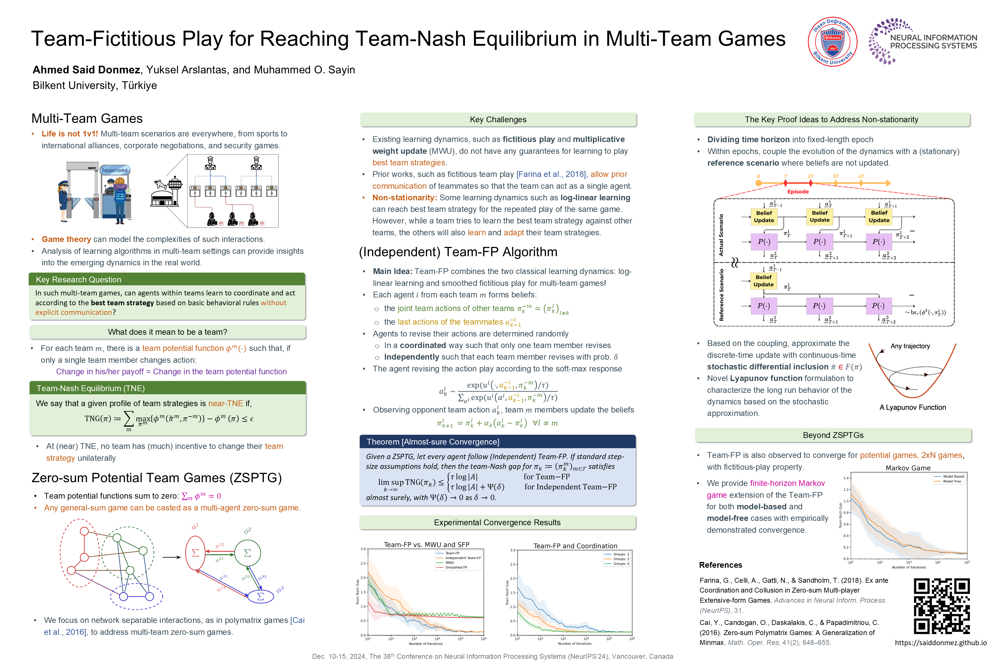

I am currently pursuing an M.S. degree in Electrical and Electronics Engineering at Bilkent University under [Dr. Muhammed Sayın’s](https://gdn.bilkent.edu.tr/sayin/) supervision. I am a member of [Games, Decisions and Networks Lab](https://gdn.bilkent.edu.tr/), and my master studies span multi-agent reinforcement learning, algorithmic game theory, and networked games. Recently, my area of interest shifted towards robotics, and reinforcement learning.

I want to pursue Ph.D. in the area of robotics and learning next year. I am applying to top-tier robotics lab in the world for my Ph.D. studies.

## 📰 Recent News
- 🎉 Our paper "Team-Fictitious Play for Reaching Team-Nash Equilibrium in Multi-team Games" has been accepted for presentation at the **[NeurIPS 2024](https://neurips.cc/virtual/2024/poster/96521)**!

  

## 📚 Teaching Experience
- **Bilkent University** - *Teaching Assistant*
  - EEE 212 - Microcontrollers and Embedded System (Spring 2024, Fall 2024)
  - EEE 321 - Signals and Systems (Fall 2023)
